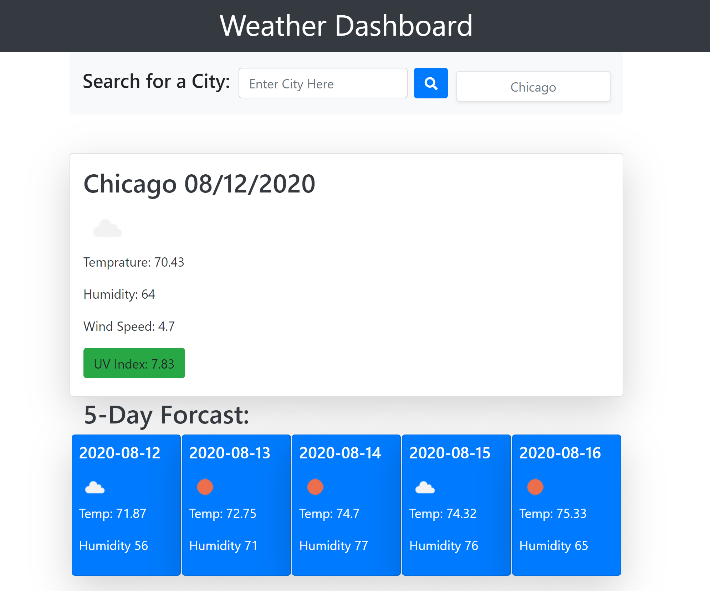

# Weather_Forecast

## Summary:
* This application allows the user to look up the weather for their desired city, and also provides the forecast for the preceeding five days. 

## Instructions:
* Enter the city in the search bar.
* Preass the search button.
* Click the save button.

## Features:
* Past searches are saved and he User is able to toggle between past searches.

## Links:
[Weather your way here](https://andal-a.github.io/Weather_Forecast/)
